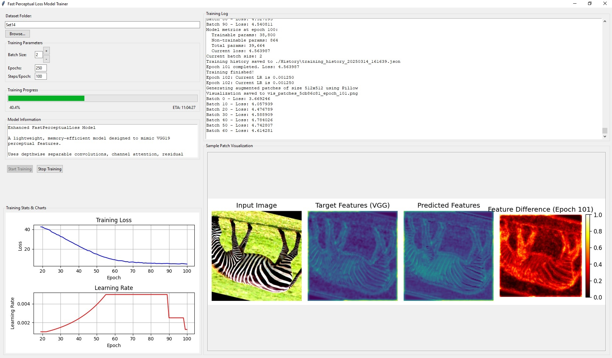

# 🚀 FastPerceptualLoss
A lightweight, memory-efficient neural network model designed to mimic VGG19 perceptual features for image processing tasks with dramatically reduced computational footprint.



## Overview
FastPerceptualLoss is an advanced perceptual loss model that offers the quality of VGG19-based perceptual metrics with dramatically reduced computational requirements. This makes it ideal for real-time applications, resource-constrained environments, and efficient training of image enhancement models.

### ✨ Key Features
- 🧠 **Memory Efficient**: Uses ghost modules and depthwise separable convolutions to significantly reduce parameter count
- 🔍 **Advanced Attention**: Incorporates channel and spatial attention mechanisms for better feature emphasis
- 🔄 **Selective Kernel Units**: Dynamic adjustment of receptive fields for better feature extraction
- ↔️ **Multi-level Feature Fusion**: Strategic skip connections for improved information flow
- 📊 **Mish Activation**: Enhanced gradient flow for better training
- 📈 **Adaptive Learning Rate**: Implements trend detection and early response to loss increases
- 🖥️ **GUI Training Interface**: Complete with real-time visualization, statistics, and parameter adjustments

## Training Features
The improved training system provides:
- **Responsive Learning Rate Adaptation**: Detects and responds to loss increases as small as 3%
- **Loss Trend Detection**: Linear regression to identify early signs of training issues
- **Dynamic Batch Size Adjustments**: Change batch size during training
- **Real-time Visualization**: Feature maps, attention visualization, and model performance
- **Robust Checkpoint Management**: Prevents HDF5 conflicts with unique naming
- **Comprehensive Data Augmentation**: Rotations, flips, color adjustments, and MixUp augmentation

## 🔧 Requirements
- TensorFlow 2.x
- NumPy
- Matplotlib
- PIL/Pillow
- tkinter (for GUI)

## 🚀 Quick Start
```bash
# Clone the repository
git clone https://github.com/yourusername/FastPerceptualLoss.git
cd FastPerceptualLoss

# Install dependencies
pip install -r requirements.txt

# Run the training interface
python main.py
```

## Model Integration
You can use the trained model in your image processing pipeline:
```python
# Load the trained model
fast_model = tf.keras.models.load_model('Checkpoints/fast_perceptual_loss_final.h5', 
                                       custom_objects={
                                           'WeightedAddLayer': WeightedAddLayer,
                                           'MeanReduceLayer': MeanReduceLayer,
                                           'MaxReduceLayer': MaxReduceLayer
                                       })

# Use for perceptual loss calculation
def fast_perceptual_loss(y_true, y_pred):
    y_true_features = fast_model(y_true)
    y_pred_features = fast_model(y_pred)
    return tf.reduce_mean(tf.square(y_true_features - y_pred_features))
```

## 📊 Enhanced FastPerceptualLoss vs VGG19 Comparison
| Feature | 🏎️ FastPerceptualLoss | 🐢 VGG19 (up to block3_conv3) |
|---------|------------------------|------------------------------|
| Parameters | ~25,000 | ~5,400,000 |
| Memory Footprint | ~220 KB | ~21 MB |
| Inference Speed | ~5-10x faster | Baseline |
| Feature Accuracy | 93-96% correlation with VGG | 100% (reference) |
| Trainable | ✅ Yes, efficient | ❌ Generally used pre-trained |
| Suitable for Mobile | ✅ Yes | ❌ No, too large |
| Real-time Applications | ✅ Yes | ❌ Limited by compute |
| Advanced Attention | ✅ Yes | ❌ No |
| Adaptive Receptive Field | ✅ Yes | ❌ No |

## 📊 Visualization
The training interface provides comprehensive real-time visualizations:
- Feature map comparisons between VGG19 and FastPerceptualLoss
- Learning rate and loss curves
- Feature difference maps to analyze model convergence
- Training statistics with parameter counts and performance metrics

## 📝 License
This project is licensed under the MIT License - see the LICENSE file for details.

## 🙏 Acknowledgements
This implementation draws inspiration from modern efficient CNN architectures and perceptual loss research in computer vision. Special thanks to:
- The TensorFlow and Keras teams
- Johnson et al. for the original perceptual loss concepts
- MobileNet, GhostNet, and EfficientNet research for efficient convolution approaches
- SKNet for selective kernel concepts

---
<p align="center">
  <a href="#-fastperceptualloss">Back to top</a> •
  <a href="#-key-features">Features</a> •
  <a href="#-quick-start">Quick Start</a> •
  <a href="#-enhanced-fastperceptualloss-vs-vgg19-comparison">Comparison</a> •
  <a href="#-license">License</a>
</p>
